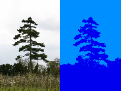

A MATLAB wrapper for solving DenseCRF problems [1,2]. 
The code uses the c++ library provided with [2].

Getting started
--
* Setup a C++ compiler in MATLAB using `mex -setup`, you will need to have a supported compiler installed, see [https://www.mathworks.com/support/compilers.html](https://www.mathworks.com/support/compilers.html) for a list
* To solve a general problem see examples/example.m
* To perform segmentation on the MSRC-21 database using the unary potentials from [http://graphics.stanford.edu/projects/densecrf/unary/](http://graphics.stanford.edu/projects/densecrf/unary/) see examples/example_MSRC.m

Included solvers
--
* Mean field approximation, using approximate filtering [2]
* Mean field approximation, performing all summations explicitly (slow)
* TRW-S [3]
* Graph cuts [4] (only works for 2 label problems)

References
--
1. __Efficient Inference in Fully Connected CRFs with Gaussian Edge Potentials__.  
Conference on Neural Information Processing Systems (NIPS), 2011.  
_Philipp Krähenbühl and Vladlen Koltun_.

2. __Parameter Learning and Convergent Inference for Dense Random Fields__.  
International Conference on Machine Learning (ICML), 2013.  
_Philipp Krähenbühl and Vladlen Koltun_.

3. __Convergent Tree-reweighted Message Passing for Energy Minimization__.  
IEEE Transactions on Pattern Analysis and Machine Intelligence (PAMI), 2006.  
_Vladimir Kolmogorov_.

4. __An Experimental Comparison of Min-Cut/Max-Flow Algorithms for Energy Minimization in Computer Vision__.  
IEEE Transactions on Pattern Analysis and Machine Intelligence (PAMI), 2004  
_Yuri Boykov and Vladimir Kolmogorov_.
